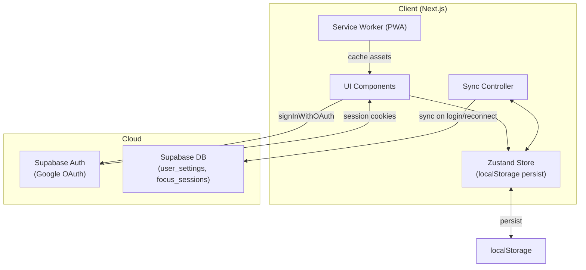
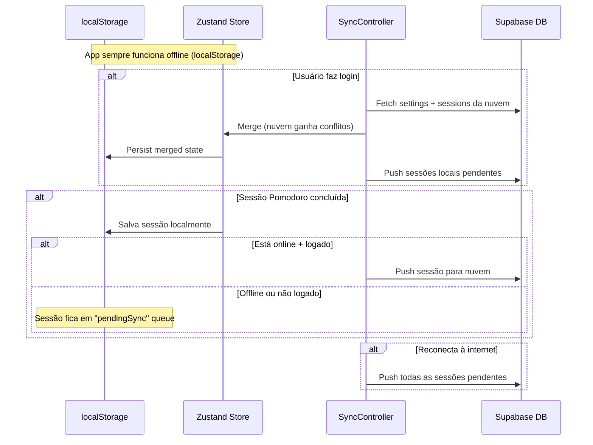

# PomoLock — Login Google + Settings + Sync + PWA

Plano completo para implementar autenticação Google, página `/settings`, sincronização offline/online com Supabase, e PWA.

## User Review Required

> [!IMPORTANT]
> **Passos manuais (feitos por você antes da implementação):**
> 1. Instalar a [integração Supabase no Vercel Marketplace](https://vercel.com/integrations/supabase) — cria o projeto Supabase e sincroniza env vars automaticamente
> 2. Criar credenciais OAuth no [Google Cloud Console](https://console.cloud.google.com/auth/clients/create) (tipo "Web application"):
>    - **Authorized JavaScript origins**: `http://localhost:3000` + domínio Vercel
>    - **Authorized redirect URIs**: copiar do dashboard Supabase > Auth > Providers > Google
> 3. Registrar **Client ID** + **Client Secret** no Supabase > Authentication > Providers > Google

> [!WARNING]
> **Decisão de escopo tomada:** a app funciona **sem login** (dados no localStorage). Login é opcional — ao fazer login, os dados locais são sincronizados para a nuvem.

---

## Arquitetura Geral



---

## Fase 1 — Autenticação Google

### Integração Vercel ↔ Supabase

Env vars sincronizadas automaticamente: `NEXT_PUBLIC_SUPABASE_URL`, `NEXT_PUBLIC_SUPABASE_ANON_KEY`, `SUPABASE_SERVICE_ROLE_KEY`. Para dev local, copiar para `.env.local`.

### Arquivos

#### [NEW] [middleware.ts](file:///c:/Users/tiago/Desktop/Estudos%20Python/projeto/src/middleware.ts)

Middleware Next.js para renovar sessão Supabase em cada request. **Não bloqueia** acesso a nenhuma rota (app é pública).

- `createServerClient` do `@supabase/ssr`
- `supabase.auth.getUser()` para renovar tokens
- Matcher exclui estáticos e assets

#### [NEW] [route.ts](file:///c:/Users/tiago/Desktop/Estudos%20Python/projeto/src/app/auth/callback/route.ts)

Callback PKCE: recebe `?code=`, chama `exchangeCodeForSession(code)`, redireciona para `/`.

#### [NEW] [page.tsx](file:///c:/Users/tiago/Desktop/Estudos%20Python/projeto/src/app/login/page.tsx)

Página de login com botão "Entrar com Google". Design dark, ícone Google, glassmorphism.

#### [NEW] [page.tsx](file:///c:/Users/tiago/Desktop/Estudos%20Python/projeto/src/app/auth/auth-code-error/page.tsx)

Página de erro para falha no OAuth callback.

#### [NEW] [useUser.ts](file:///c:/Users/tiago/Desktop/Estudos%20Python/projeto/src/hooks/useUser.ts)

Hook: `{ user, loading }` via `getUser()` + `onAuthStateChange()`.

#### [MODIFY] [Navbar.tsx](file:///c:/Users/tiago/Desktop/Estudos%20Python/projeto/src/components/Navbar.tsx)

- Logado: avatar Google + link para `/settings`
- Não logado: botão "Login" → `/login`

---

## Fase 2 — Página `/settings` (substitui o Dialog)

### Mudança arquitetural

O [SettingsDialog](file:///c:/Users/tiago/Desktop/Estudos%20Python/projeto/src/components/settings/SettingsDialog.tsx#20-349) atual (popup modal) será **substituído** por uma página `/settings` completa. As configurações existentes (timer, som, cores) ficam na mesma página junto com a seção de **Conta** (info do Google, logout, sincronização).

#### [NEW] [page.tsx](file:///c:/Users/tiago/Desktop/Estudos%20Python/projeto/src/app/settings/page.tsx)

Página full-page com seções:

| Seção | Conteúdo |
|---|---|
| **Conta** | Avatar, nome, email do Google, botão Logout, status de sync |
| **Timer** | Durações (focus, short break, long break), pomodoros até long break |
| **Auto-start** | Breaks, Pomodoros |
| **Som** | Habilitado, tom do alarme, volume, repeat count |
| **Geral** | Timer no título do browser |
| **Cores** | Cores dos modos + dashboard accent |
| **Danger Zone** | Reset statistics, deletar conta |

Se **não logado**, a seção "Conta" mostra um CTA para login.

#### [DELETE] referências ao [SettingsDialog](file:///c:/Users/tiago/Desktop/Estudos%20Python/projeto/src/components/settings/SettingsDialog.tsx#20-349) como popup

- [MODIFY] [Navbar.tsx](file:///c:/Users/tiago/Desktop/Estudos%20Python/projeto/src/components/Navbar.tsx) — trocar ícone SettingsDialog por link para `/settings`
- [MODIFY] [page.tsx](file:///c:/Users/tiago/Desktop/Estudos%20Python/projeto/src/app/dashboard/page.tsx) — remover import do SettingsDialog
- O componente [SettingsDialog.tsx](file:///c:/Users/tiago/Desktop/Estudos%20Python/projeto/src/components/settings/SettingsDialog.tsx) **continua existindo** mas pode ser removido depois (ou mantido como fallback mobile)

---

## Fase 3 — Schema Supabase (Migrations)

Duas tabelas no banco para sincronizar dados do usuário logado:

```sql
-- user_settings: configurações do timer por usuário
CREATE TABLE public.user_settings (
    user_id UUID PRIMARY KEY REFERENCES auth.users(id) ON DELETE CASCADE,
    settings JSONB NOT NULL DEFAULT '{}',
    updated_at TIMESTAMPTZ NOT NULL DEFAULT now()
);

ALTER TABLE public.user_settings ENABLE ROW LEVEL SECURITY;

CREATE POLICY "Users can read own settings" ON public.user_settings
    FOR SELECT USING (auth.uid() = user_id);
CREATE POLICY "Users can upsert own settings" ON public.user_settings
    FOR ALL USING (auth.uid() = user_id);

-- focus_sessions: histórico de sessões pomodoro
CREATE TABLE public.focus_sessions (
    id UUID PRIMARY KEY DEFAULT gen_random_uuid(),
    user_id UUID NOT NULL REFERENCES auth.users(id) ON DELETE CASCADE,
    started_at TIMESTAMPTZ NOT NULL,
    duration_minutes INT NOT NULL,
    actual_duration_seconds INT NOT NULL,
    hyperfocus_seconds INT NOT NULL DEFAULT 0,
    completed BOOLEAN NOT NULL DEFAULT true,
    created_at TIMESTAMPTZ NOT NULL DEFAULT now()
);

ALTER TABLE public.focus_sessions ENABLE ROW LEVEL SECURITY;

CREATE POLICY "Users can read own sessions" ON public.focus_sessions
    FOR SELECT USING (auth.uid() = user_id);
CREATE POLICY "Users can insert own sessions" ON public.focus_sessions
    FOR INSERT WITH CHECK (auth.uid() = user_id);
```

---

## Fase 4 — Offline-First + Sync

### Estratégia



### Arquivos

#### [NEW] [syncController.ts](file:///c:/Users/tiago/Desktop/Estudos%20Python/projeto/src/lib/syncController.ts)

- `syncOnLogin()` — merge settings + push pending sessions
- `pushSession(session)` — envia sessão para Supabase (ou enfileira se offline)
- `syncPending()` — flush da fila de sessões pendentes
- Escuta `navigator.onLine` para auto-sync ao reconectar

#### [MODIFY] [timerStore.ts](file:///c:/Users/tiago/Desktop/Estudos%20Python/projeto/src/stores/timerStore.ts)

- Adicionar field `pendingSessions: FocusSession[]` no state
- Ao completar pomodoro, salvar sessão em `pendingSessions`
- Persistir `pendingSessions` no localStorage junto com o resto

---

## Fase 5 — PWA

### Arquivos

#### [NEW] [manifest.json](file:///c:/Users/tiago/Desktop/Estudos%20Python/projeto/public/manifest.json)

```json
{
  "name": "PomoLock",
  "short_name": "PomoLock",
  "description": "Pomodoro Timer with hyperfocus mode",
  "start_url": "/",
  "display": "standalone",
  "background_color": "#1A1B24",
  "theme_color": "#e74c6f",
  "icons": [...]
}
```

#### Dependência: `next-pwa`

- Instalar `next-pwa` para gerar service worker automaticamente
- Configurar em [next.config.ts](file:///c:/Users/tiago/Desktop/Estudos%20Python/projeto/next.config.ts) com `withPWA()`
- Cache de assets estáticos + páginas visitadas
- App instalável em celular e desktop

#### [MODIFY] [layout.tsx](file:///c:/Users/tiago/Desktop/Estudos%20Python/projeto/src/app/layout.tsx)

- Adicionar `<link rel="manifest" href="/manifest.json">`
- Adicionar meta tags PWA (`theme-color`, `apple-mobile-web-app-capable`)

#### [NEW] Ícones PWA

- Gerar ícones 192x192 e 512x512 em `public/`

---

## Resumo de Todos os Arquivos

| Fase | Ação | Arquivo |
|---|---|---|
| 1 | ✨ NEW | `src/middleware.ts` |
| 1 | ✨ NEW | `src/app/auth/callback/route.ts` |
| 1 | ✨ NEW | `src/app/login/page.tsx` |
| 1 | ✨ NEW | `src/app/auth/auth-code-error/page.tsx` |
| 1 | ✨ NEW | `src/hooks/useUser.ts` |
| 1 | ✏️ MODIFY | [src/components/Navbar.tsx](file:///c:/Users/tiago/Desktop/Estudos%20Python/projeto/src/components/Navbar.tsx) |
| 2 | ✨ NEW | `src/app/settings/page.tsx` |
| 2 | ✏️ MODIFY | [src/app/dashboard/page.tsx](file:///c:/Users/tiago/Desktop/Estudos%20Python/projeto/src/app/dashboard/page.tsx) |
| 3 | 🗄️ MIGRATION | `user_settings` + `focus_sessions` tables |
| 4 | ✨ NEW | `src/lib/syncController.ts` |
| 4 | ✏️ MODIFY | [src/stores/timerStore.ts](file:///c:/Users/tiago/Desktop/Estudos%20Python/projeto/src/stores/timerStore.ts) |
| 5 | ✨ NEW | `public/manifest.json` |
| 5 | ✨ NEW | PWA icons (192x192, 512x512) |
| 5 | ✏️ MODIFY | [next.config.ts](file:///c:/Users/tiago/Desktop/Estudos%20Python/projeto/next.config.ts) (withPWA) |
| 5 | ✏️ MODIFY | [src/app/layout.tsx](file:///c:/Users/tiago/Desktop/Estudos%20Python/projeto/src/app/layout.tsx) (manifest + meta) |

---

## Ordem de Implementação Sugerida

1. **Fase 1** (Auth) → base para tudo, pode testar login isoladamente
2. **Fase 3** (Schema) → precisa existir antes de sincronizar
3. **Fase 2** (Settings page) → substitui o dialog, integra conta + config
4. **Fase 4** (Sync) → depende de auth + schema + settings
5. **Fase 5** (PWA) → independente, pode ser feita em paralelo

---

## Verification Plan

### Teste Manual

1. `pnpm dev` → timer funciona sem login, dados no localStorage ✓
2. Login com Google → redirecionado para consent → retorna logado ✓
3. `/settings` → mostra todas as configs + seção conta com avatar ✓
4. Alterar config logado → salva no Supabase + localStorage ✓
5. Logout e login de novo → settings restaurados da nuvem ✓
6. Completar pomodoro offline → sessão enfileirada localmente ✓
7. Reconectar → sessões pendentes sincronizadas ✓
8. Instalar PWA (Chrome > "Install App") → funciona standalone ✓
9. Abrir PWA offline → timer funciona normalmente ✓
